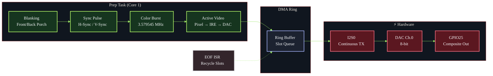
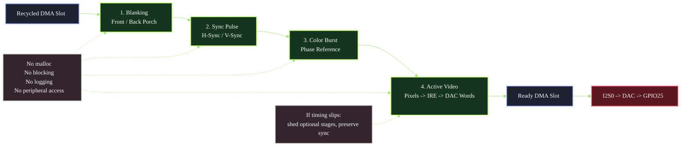

<div align="center">


[](https://docs.espressif.com/projects/esp-idf/)
[](https://en.wikipedia.org/wiki/C11_(C_standard_revision))
[](https://www.espressif.com/en/products/socs/esp32)
[](./tests)
[](./LICENSE)

**Scanlines are the heartbeat. Sync is the contract. The signal never lies.**

---

*"The phosphor doesn't care about your framebuffer. It cares about the next 63.5µs."*

</div>

---

> [!IMPORTANT]
> **Signal-first architecture.** The scanline is the realtime unit, not the frame.
> Every stage — sync, burst, active video — is a deterministic pipeline stage
> executed on a pinned core with zero allocations after init. If you can't finish
> the line in time, you shed stages. You never lose sync.

---

## ⚡ Quick Start

```c
#include "crt_core.h"

void app_main(void)
{
    crt_core_config_t config = {
        .video_standard       = CRT_VIDEO_STANDARD_NTSC,
        .demo_pattern_mode    = CRT_DEMO_PATTERN_COLOR_BARS_RAMP,
        .target_ready_depth   = 4,
        .min_ready_depth      = 2,
        .prep_task_core       = 1,
    };

    crt_core_init(&config);
    crt_core_start();
    // GPIO25 is now outputting NTSC composite video via DAC
}
```

```bash
# Build & flash
idf.py build
idf.py -p /dev/ttyUSB0 flash monitor
```

---

## 🏗️ Architecture



---

## 📦 Components

| Component             | Role                               | Key Constraint                   |
|:----------------------|:-----------------------------------|:---------------------------------|
| **`crt_core`**        | Engine — orchestrates the pipeline | No alloc after `start()`         |
| **`crt_hal`**         | I2S0 + DAC hardware abstraction    | GPIO25 only, internal SRAM DMA   |
| **`crt_timing`**      | NTSC/PAL timing profiles           | µs-precise blanking/sync tables  |
| **`crt_waveform`**    | Burst & chroma synthesis           | 3.579545 MHz NTSC colorburst     |
| **`crt_line_policy`** | Per-line type decisions            | VBI, sync, active classification |
| **`crt_demo`**        | Test pattern generator             | Color bars, ramps, grids         |
| **`crt_diag`**        | Runtime telemetry                  | Late line detection, ISR stats   |
| **`crt_fb`**          | Framebuffer stub                   | Future: external pixel source    |

---

## 🔬 Signal Pipeline

Each scanline passes through deterministic stages with a strict contract:



**Stage rules:**
- No `malloc`, no blocking, no logging, no peripheral access
- Each stage writes directly into a preallocated DMA buffer
- If a stage can't complete in time → shed it, keep sync

---

## 📐 Timing Reference

| Parameter        |              NTSC |                 PAL |
|:-----------------|------------------:|--------------------:|
| **Line period**  |         63.556 µs |           64.000 µs |
| **H-sync**       |            4.7 µs |              4.7 µs |
| **Front porch**  |            1.5 µs |             1.65 µs |
| **Back porch**   |            4.7 µs |              5.7 µs |
| **Color burst**  | 2.5 µs (9 cycles) | 2.25 µs (10 cycles) |
| **Active video** |           52.6 µs |            51.95 µs |
| **Burst freq**   |      3.579545 MHz |      4.43361875 MHz |
| **Total lines**  | 525 (262.5/field) |   625 (312.5/field) |
| **Field rate**   |          59.94 Hz |            50.00 Hz |

---

## 📂 Project Structure

```
esp32-crt-signal-core/
├── main/
│   └── app_main.c                          # Entry point
├── components/
│   ├── crt_core/                           # Engine + pipeline stages
│   │   ├── include/
│   │   │   ├── crt_core.h                  # Public API
│   │   │   ├── crt_stage.h                 # Stage contract
│   │   │   ├── crt_waveform.h              # Burst/chroma synthesis
│   │   │   └── crt_line_policy.h           # Line type classifier
│   │   ├── crt_core.c
│   │   ├── crt_waveform.c
│   │   └── crt_line_policy.c
│   ├── crt_hal/                            # I2S0 + DAC driver
│   ├── crt_timing/                         # NTSC/PAL timing profiles
│   ├── crt_demo/                           # Test pattern generator
│   ├── crt_diag/                           # Runtime telemetry
│   └── crt_fb/                             # Framebuffer interface (stub)
├── tests/                                  # Host-compiled C tests
│   ├── burst_waveform_test.c
│   ├── crt_timing_profile_test.c
│   ├── crt_demo_pattern_test.c
│   └── line_policy_test.c
├── docs/                                   # Reference docs
├── .clang-format                           # Code style (embedded C)
├── .clang-tidy                             # Static analysis config
├── .editorconfig                           # Editor consistency
├── CMakeLists.txt                          # ESP-IDF project root
└── sdkconfig                               # ESP-IDF Kconfig
```

---

## 🛠️ Build

<details>
<summary><strong>📋 Prerequisites</strong></summary>

| Tool       | Version                   |
|:-----------|:--------------------------|
| ESP-IDF    | `>= 5.4`                  |
| CMake      | `>= 3.16`                 |
| GCC (host) | For running tests locally |
| Target SoC | ESP32-D0WD-V3             |

</details>

```bash
# Clone
git clone https://github.com/gabrielmaialva33/esp32-crt-signal-core.git
cd esp32-crt-signal-core

# Source ESP-IDF (if not already)
. $IDF_PATH/export.sh

# Build
idf.py build

# Flash & monitor
idf.py -p /dev/ttyUSB0 flash monitor
```

### Running Tests (Host)

```bash
# Burst waveform synthesis
gcc -I components/crt_core/include -I components/crt_timing/include \
    tests/burst_waveform_test.c components/crt_core/crt_waveform.c \
    -lm -o /tmp/burst_test && /tmp/burst_test

# Line policy
gcc -I components/crt_core/include -I components/crt_timing/include \
    tests/line_policy_test.c components/crt_core/crt_line_policy.c \
    -o /tmp/policy_test && /tmp/policy_test

# Timing profiles
gcc -I components/crt_timing/include \
    tests/crt_timing_profile_test.c components/crt_timing/crt_timing.c \
    -o /tmp/timing_test && /tmp/timing_test

# Demo patterns
gcc -I components/crt_core/include -I components/crt_timing/include \
    -I components/crt_demo/include \
    tests/crt_demo_pattern_test.c components/crt_demo/crt_demo_pattern.c \
    components/crt_core/crt_waveform.c -lm \
    -o /tmp/demo_test && /tmp/demo_test
```

---

## 📊 Stats

| Metric             |           Value |
|:-------------------|----------------:|
| **C source files** |               8 |
| **Header files**   |               8 |
| **Test suites**    |               4 |
| **Total lines**    |           1,676 |
| **Components**     |               6 |
| **DMA channels**   | I2S0 continuous |
| **DAC resolution** |           8-bit |
| **Output pin**     |          GPIO25 |

---

## 📜 License

[MIT](./LICENSE) — Gabriel Maia

---

<div align="center">


*Built with phosphor persistence and scanline discipline.*


</div>
